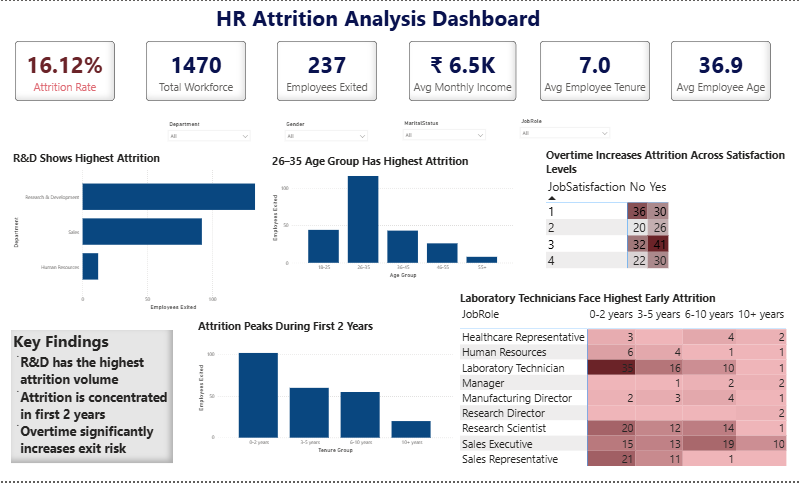

# HR Attrition Analysis Dashboard

## Project Objective
This project analyzes employee attrition patterns to identify key factors contributing to workforce exits. The goal is to uncover attrition drivers and provide actionable recommendations to improve employee retention.

## Tools Used
- Power BI
- MS Excel

## Dashboard Overview
The dashboard provides insights into:
- Attrition by department
- Attrition by age group
- Attrition by tenure
- Attrition by role and tenure
- Impact of overtime on attrition

## Key Insights
- R&D department recorded the highest attrition among all departments.
- Employees aged 26–35 exhibited the highest attrition rate.
- Attrition peaks during the first two years of employment.
- Laboratory Technicians face the highest attrition risk in early tenure.
- Overtime significantly increases attrition across satisfaction levels.

## Business Recommendation
Targeted retention initiatives should focus on R&D employees in their first two years, along with overtime management strategies and improved onboarding support for technical roles.

---

## Dashboard Preview

